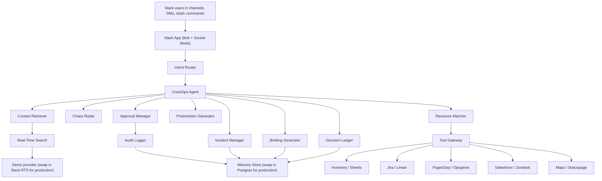

# How CrisisOps Is Built

## The Big Picture



---

## What Each Part Does

| Module | What it does |
|--------|-------------|
| `intentRouter` | Reads a Slack command or mention and figures out what the user wants |
| `contextRetriever` | Pulls recent Slack messages relevant to the incident |
| `realTimeSearchService` | Search provider — uses demo data now, Slack's search API in production |
| `mcpGatewayClient` | Calls external tools (inventory, ticketing, on-call, etc.) |
| `incidentStateManager` | Opens an incident and tracks its tasks and events |
| `chaosRadar` | Scans messages across channels to catch an emerging incident early |
| `decisionLedger` | Records key decisions with owner, rationale, risk, and evidence |
| `resourceMatcher` | Finds urgent needs and matches them to available resources |
| `briefingGenerator` | Writes a sourced situation summary from real Slack context |
| `postmortemGenerator` | Turns the incident log into a structured after-action report |
| `approvalManager` | Holds external updates until a human approves them |
| `auditLogger` | Logs every high-risk action for the record |

---

## Data Storage

The demo uses an in-memory store so there is nothing to install or configure. For production, swap it for Postgres — the schema is in `docs/schema.sql`.

---

## Real-Time Search

The demo searches pre-loaded example Slack messages. The search interface looks like this:

```ts
search(query, { sinceIso, channels, limit })
```

A production adapter connects to Slack's real-time search API using the same interface, so no other code needs to change.

Briefings only include facts found through search. The agent never invents information.

---

## External Tools (MCP)

The tool gateway connects to these capabilities:

| Tool | What it does |
|------|-------------|
| `search_inventory` | Finds available resources (generators, staff, supplies) |
| `reserve_resource` | Reserves a resource and logs it |
| `create_ticket` | Opens a ticket in Jira or a similar system |
| `create_status_update` | Drafts an external status page update |
| `get_on_call_owner` | Finds out who is on call right now |
| `get_customer_impact` | Looks up how many customers are affected |
| `get_location_eta` | Gets an estimated arrival time for field resources |

Every tool call is recorded in the audit log.
