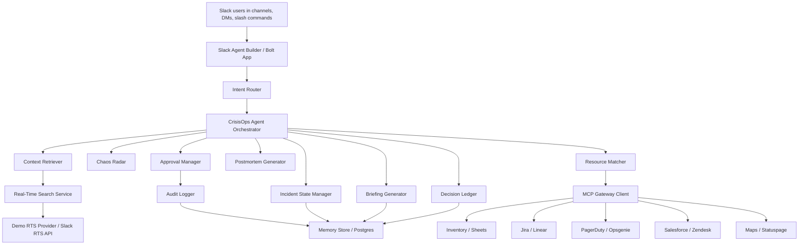

# Architecture



## Agent Modules

- `intentRouter`: classifies Slack commands and mentions.
- `contextRetriever`: retrieves operational context through RTS abstraction.
- `realTimeSearchService`: mock provider now, Slack RTS adapter later.
- `mcpGatewayClient`: MCP-style tool gateway with mock enterprise adapters.
- `incidentStateManager`: opens incidents and initializes tasks/events.
- `chaosRadar`: detects emerging incidents from cross-channel signals.
- `decisionLedger`: suggests and formats auditable decisions.
- `resourceMatcher`: extracts needs and ranks resource matches.
- `briefingGenerator`: creates sourced situation briefs.
- `postmortemGenerator`: generates post-incident reports.
- `approvalManager`: enforces human approval before external writes.
- `auditLogger`: records high-risk actions.

## Data Model

See `docs/schema.sql` for the production Postgres schema. The local demo uses `MemoryStore` to keep setup fast for judges.

## Real-Time Search

The demo provider searches seeded Slack-like messages by query terms, tags, channel, and timestamp. A production Slack RTS adapter should preserve the same interface:

```ts
search(query, { sinceIso, channels, limit })
```

Briefings cite source permalinks and should never include facts that are not present in RTS results or MCP outputs.

## MCP Integrations

The MCP gateway exposes these tools:

- `search_inventory`
- `reserve_resource`
- `create_ticket`
- `create_status_update`
- `get_on_call_owner`
- `get_customer_impact`
- `get_location_eta`

All tool calls are logged in `external_tool_calls`.
